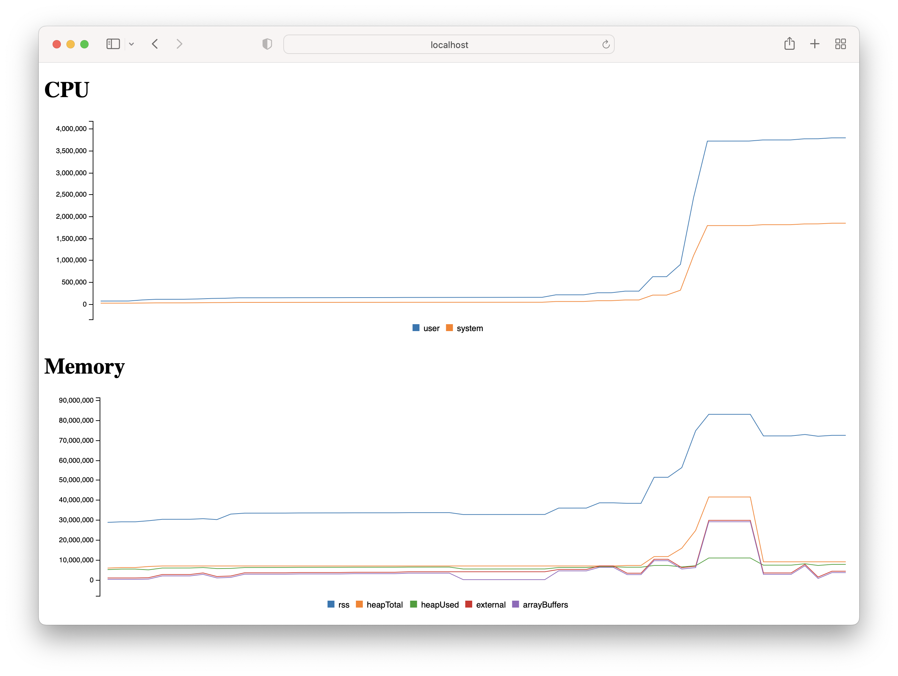

## @kelpjs/monitor

> Simple Node.js Application Performance Monitoring



### Install

```sh
~$ yarn add @kelpjs/monitor
```

### Usage

```patch
+ require('@kelpjs/monitor/start');
```

### License

This project is licensed under the MIT License.